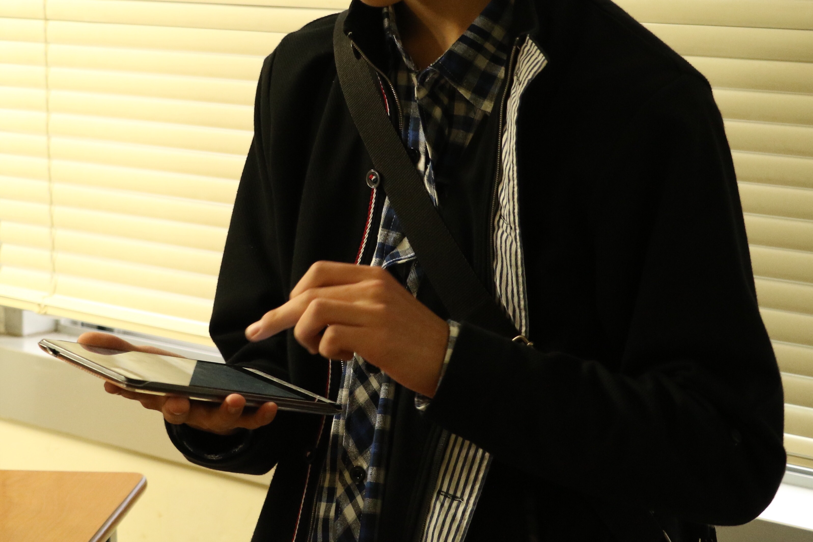
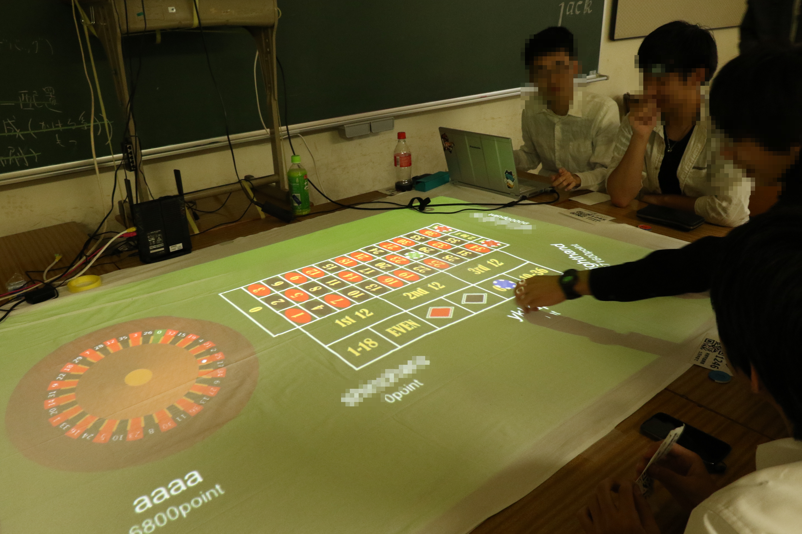
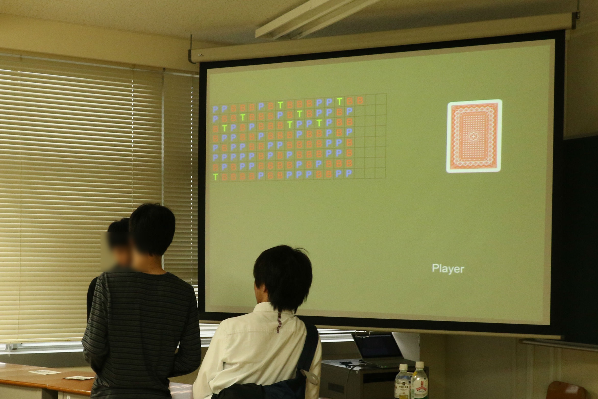

# 2016年度写真
### プレイヤー登録作業
あらかじめ印刷されたQRコードを読み取り、プレイヤー名を入力してもらうことで登録ができます。
プレイヤーはこのQRコードを提示してゲームに参加します。

### ゲーム進行
トランプを使用したゲームはAndroidタブレットに入力して行います。

### ルーレット
プロジェクターの前に鏡を置き、机上のスクリーンに画面を投影しています。
画像処理等はWindowsパソコンを使用していて、ルーレットは物理エンジンで抽選を行います。

### バカラ
Androidタブレットからベットを入力すると、サーバ内でトランプが引かれてスクリーン上に結果が表示されます。

